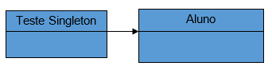

# N1DesignPattern
N1B2 Grupo08 Design Pattern

Grupo 08:
Caio Vinicius Magro – 081200042 
Giovana Moreira da Silva – 081200043
Marcio Rios Kunimura – 081200041
Matheus de Novais Souza – 081190048 
Ysabela Akiyama Molero Rodrigues – 081200044

Nome: Singleton
Tipo: Criação
Objetivo: Garantir que a classe tenha uma única instância e promover um meio global de acesso a essa instância
Diagrama UML:

Nome: Proxy
Tipo: Estrutura
Objetivo: O Proxy é um padrão de projeto estrutural que permite que você forneça um substituto ou um espaço reservado para outro objeto. Um proxy controla o acesso ao objeto original, permitindo que você faça algo ou antes ou depois do pedido chegar ao objeto original.
Diagrama UML:

